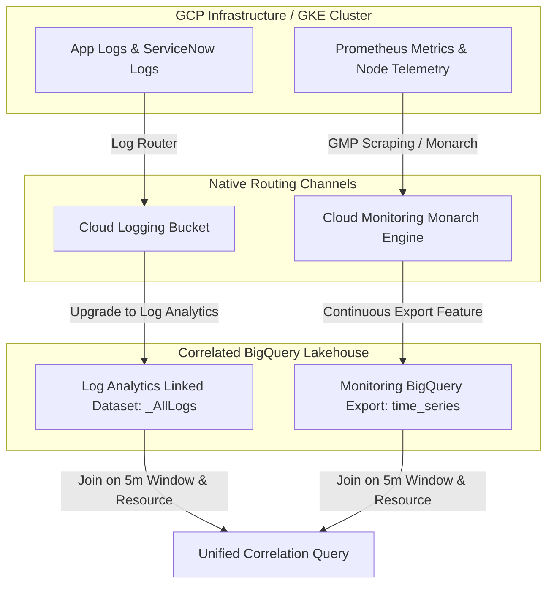
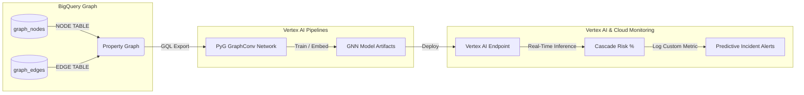

# GCP Telemetry: Anomaly Forecasting & Predictive Alerting Control Center

This repository contains a production-grade, out-of-the-box infrastructure provisioning package and sandbox interface designed to implement **ML-driven Anomaly Forecasting & Predictive Alerting** natively on Google Cloud Platform. 

It provides an elegant, zero-ops, serverless alternative to Kibana Machine Learning, allowing any enterprise or team using **Cloud Logging**, **Cloud Monitoring**, and **Google Managed Service for Prometheus (GMP)** to automate capacity forecasting and log anomaly detection without managing dedicated ML clusters.


---

### 🖥️ Live Sandbox Interface Showcase

| 📈 1. Standard ARIMA Forecasting & Predictive Capacity Planning |
| :--- |
|  |

| 🧠 2. Graph Neural Network Topology Mapping (Nominal State) | 🚨 3. Cascading Failure Threat Propagation (Anomaly Injected) |
| :--- | :--- |
|  |  |

---

## 🏗️ ELK-to-GCP Architectural Mapping

Google Cloud offers highly scalable, zero-ops alternatives that match or exceed Kibana's machine learning capabilities:

| Kibana ML / ELK Feature | GCP Native Replacement | Architectural Justification |
| :--- | :--- | :--- |
| **Kibana Anomaly Detection** (Metrics) | **Cloud Monitoring Predictive Alerts + PromQL/MQL Dynamic Limits** | Prometheus metrics reside natively in Cloud Monitoring (Monarch). We use **Predictive Alerting** (which projects metrics into the future using native linear engines) and sliding-window standard deviations for dynamic thresholds. |
| **Kibana Log Anomaly Detection** (App Logs) | **Cloud Logging Log Analytics (BigQuery) + BigQuery ML (BQML)** | Upgrading logging buckets to **Log Analytics** exposes log tables in BigQuery. BigQuery ML's `ARIMA_PLUS` models handle automatic holiday effects, level shifts, and outlier scrubbing in simple SQL. |
| **Kibana Forecasting** (Capacity Trends) | **BigQuery ML `ML.FORECAST` & PromQL `predict_linear`** | For capacity planning (such as disk or memory exhaustion), BQML's forecasting or GMP's `predict_linear` functions project resource exhaustion dates with statistical confidence. |

---

## 🛠️ Step-by-Step GCP Deployment Guide

This guide will walk you through authenticating with GCP, initializing Terraform, provisioning your alert policies, enabling Log Analytics, and training your first BigQuery ML time-series model.

### Prerequisites
Before you begin, ensure you have the following installed on your system:
*   [Google Cloud SDK (gcloud CLI)](https://cloud.google.com/sdk/docs/install)
*   [Terraform CLI (v1.3.0+)](https://developer.hashicorp.com/terraform/downloads)
*   A GCP project (such as `YOUR_PROJECT_ID`) with the billing, logging, monitoring, and BigQuery APIs enabled.

---

### Step 1: Authenticate with Google Cloud
Open your terminal and authenticate your gcloud CLI and local Terraform environment with your GCP account:

```bash
# Log in to your GCP account
gcloud auth login

# Set your active project context
gcloud config set project YOUR_PROJECT_ID

# Generate Application Default Credentials (ADC) for Terraform to use
gcloud auth application-default login
```

---

### Step 2: Deploy Infrastructure via Terraform
We provide a complete, modular Terraform suite that automates the deployment of Log Analytics, Cloud Monitoring alert rules, and our custom dashboard.

1.  Navigate to the `terraform/` directory:
    ```bash
    cd terraform/
    ```
2.  Initialize the Terraform workspace and download the Google provider plugins:
    ```bash
    terraform init
    ```
3.  Generate an execution plan to verify what resources will be created:
    ```bash
    terraform plan -var="project_id=YOUR_PROJECT_ID"
    ```
4.  Apply the configuration to provision the resources:
    ```bash
    terraform apply -var="project_id=YOUR_PROJECT_ID" -auto-approve
    ```

#### What Terraform provisions:
*   **Log Analytics:** Enables SQL queries natively on your logging bucket (`_Default` by default) via `google_logging_project_bucket_config`.
*   **Log-Based Metrics:** Creates `servicenow_incident_count` to count and extract incident labels (country, site) from incoming logs.
*   **BigQuery ML Dataset & Job:** Provisions the `telemetry_anomaly_forecasts` dataset and runs a BQ query job to train your multi-series `ARIMA_PLUS` time-series forecasting model.
*   **Predictive Alert Policies:** Configures native Cloud Monitoring alert policies utilizing `forecast_options` with forecasting horizons for Disk, RAM, and CPU capacity.
*   **Custom Monitoring Dashboard:** Provisions a gorgeous, custom dashboard displaying metric timeseries, capacity trends, and log metrics.

---

### Step 3: Run SQL Anomaly Detection and Forecasts in BigQuery
Once your Log Analytics bucket is upgraded and your BQML model is trained by Terraform, you can run advanced SQL queries directly in the BigQuery Console to detect historical outliers or project future peaks:

#### 1. Detect Historical Log Anomalies (Outliers)
```sql
SELECT * FROM ML.DETECT_ANOMALIES(
  MODEL `YOUR_PROJECT_ID.telemetry_anomaly_forecasts.incident_volume_model`,
  STRUCT(0.99 AS anomaly_prob_threshold)
)
ORDER BY timestamp DESC;
```

#### 2. Forecast Future Log Volumes (14-Day Horizon)
```sql
SELECT 
  forecast_time, 
  forecast_value,
  prediction_interval_lower_bound,
  prediction_interval_upper_bound
FROM ML.FORECAST(
  MODEL `YOUR_PROJECT_ID.telemetry_anomaly_forecasts.incident_volume_model`,
  STRUCT(14 AS horizon, 0.95 AS confidence_level)
)
ORDER BY forecast_time ASC;
```

#### 3. Advanced Model Evaluation (ARIMA order, seasonal components, AIC, BIC)
Evaluate candidate models and view statistical diagnostic information to determine model quality (such as Akaike Information Criterion (AIC) and Bayesian Information Criterion (BIC)):
```sql
SELECT * 
FROM ML.ARIMA_EVALUATE(
  MODEL `YOUR_PROJECT_ID.telemetry_anomaly_forecasts.incident_volume_model`
);
```

#### 4. Explain Forecast (Decompose trend, seasonal, holiday, and step-changes)
Deconstruct and explain the individual trend components, seasonal patterns (weekly, daily), holiday effects, and step changes within your predicted timeline:
```sql
SELECT * 
FROM ML.EXPLAIN_FORECAST(
  MODEL `YOUR_PROJECT_ID.telemetry_anomaly_forecasts.incident_volume_model`,
  STRUCT(14 AS horizon, 0.95 AS confidence_level)
);
```

#### 5. Retrieve ARIMA Coefficients (Inspect mathematically calculated weights)
Extract the Auto-Regressive (AR) coefficients, Moving Average (MA) coefficients, drift, and intercept parameters calculated by the model's training solver:
```sql
SELECT * 
FROM ML.ARIMA_COEFFICIENTS(
  MODEL `YOUR_PROJECT_ID.telemetry_anomaly_forecasts.incident_volume_model`
);
```

#### 6. Instantly Query Pre-Configured Live BigQuery Views
To streamline analysis, Terraform automatically deploys four pre-configured views within your BigQuery dataset that dynamically call these BigQuery ML functions for you. You don't need to write the complex mathematical query syntax; simply query them like standard tables:

*   **Live 14-Day Forecasts View:**
    ```sql
    SELECT * FROM `YOUR_PROJECT_ID.telemetry_anomaly_forecasts.incident_volume_forecast_view` LIMIT 100;
    ```
*   **Live Anomalies/Outliers View:**
    ```sql
    SELECT * FROM `YOUR_PROJECT_ID.telemetry_anomaly_forecasts.incident_volume_anomalies_view` LIMIT 100;
    ```
*   **Model Evaluation Diagnostics View:**
    ```sql
    SELECT * FROM `YOUR_PROJECT_ID.telemetry_anomaly_forecasts.incident_volume_evaluation_view`;
    ```
*   **Model Coefficients View:**
    ```sql
    SELECT * FROM `YOUR_PROJECT_ID.telemetry_anomaly_forecasts.incident_volume_coefficients_view`;
    ```

---

## 🔗 Correlating Logs & Metric Timeseries in BigQuery

A common gap in cloud observability is analyzing logs and metrics in isolation. BigQuery provides the unique capability to correlate these two completely different telemetry streams—event-driven logs and interval-based metric timeseries—at massive scale using standard SQL.

### 🏗️ Ingestion & Routing Setup on GCP

To perform correlated queries, you must route both log streams and metric streams into BigQuery:



1. **Routing Logs (Log Analytics):**
   Upgrading your Cloud Logging bucket to **Log Analytics** (accomplished via `logging.tf`) automatically creates a linked BigQuery dataset. This allows logs to stream in real-time directly into a BigQuery view named `_AllLogs`.
2. **Routing Metrics (Monitoring BigQuery Export):**
   In the Google Cloud Console, navigate to **Cloud Monitoring > Settings** and configure **BigQuery Export** to continuously stream time-series metrics (including Google Managed Prometheus streams) into a BigQuery dataset table, typically named `your_dataset.monitoring_export.time_series` or custom metric aggregation tables.

---

### ⚠️ The Sub-Second Matching Challenge
Logs are **irregular and event-driven** (occurring at arbitrary milliseconds), while metrics are **regular and interval-sampled** (occurring every 15s or 60s). Direct joins on raw timestamps will always fail to match.

### 💡 The Solution: Fixed Window Bucketing
To successfully join logs and metrics, you must **bucket** timestamps into fixed intervals (such as 5-minute windows) using BigQuery's `TIMESTAMP_TRUNC` function, group by a shared resource dimension, and join the results.

Here is the production-ready SQL template to accomplish this:

```sql
-- UNIFIED LOGS & METRICS CORRELATION QUERY
-- Run this query in BigQuery to join continuous metrics with event-driven warning logs.

WITH metrics_5m AS (
  -- Step 1: Bucket high-frequency timeseries metrics into 5-minute intervals
  SELECT
    TIMESTAMP_TRUNC(timestamp, MINUTE, 5) AS timestamp_bucket,
    resource.labels.node_name AS node_id,
    AVG(point.value.double_value) AS avg_cpu_utilization
  FROM `YOUR_PROJECT_ID.monitoring_export.time_series`
  WHERE metric.type = 'kubernetes.io/container/cpu/limit_utilization'
    AND timestamp >= TIMESTAMP_SUB(CURRENT_TIMESTAMP(), INTERVAL 7 DAY)
  GROUP BY 1, 2
),

logs_5m AS (
  -- Step 2: Bucket irregular warning/error log counts into the same 5-minute intervals
  SELECT
    TIMESTAMP_TRUNC(timestamp, MINUTE, 5) AS timestamp_bucket,
    COALESCE(
      JSON_VALUE(resource.labels.node_name),
      JSON_VALUE(jsonPayload.node_name),
      "unknown-node"
    ) AS node_id,
    COUNT(1) AS log_error_count
  FROM `YOUR_PROJECT_ID.global._Default._AllLogs`
  WHERE severity IN ('ERROR', 'CRITICAL', 'WARNING')
    AND timestamp >= TIMESTAMP_SUB(CURRENT_TIMESTAMP(), INTERVAL 7 DAY)
  GROUP BY 1, 2
)

-- Step 3: Perform a FULL JOIN to align metrics and logs by time and resource
SELECT
  COALESCE(m.timestamp_bucket, l.timestamp_bucket) AS timestamp,
  COALESCE(m.node_id, l.node_id) AS node_id,
  COALESCE(m.avg_cpu_utilization, 0.0) AS cpu_utilization,
  COALESCE(l.log_error_count, 0) AS error_count,
  
  -- Step 4: Classify joint anomaly states (e.g., metric spike + concurrent log errors)
  CASE
    WHEN m.avg_cpu_utilization > 0.85 AND l.log_error_count > 10 THEN 'CRITICAL CORRELATION: CPU SPIKE COINCIDES WITH ERROR LOGS'
    WHEN m.avg_cpu_utilization > 0.85 THEN 'METRIC SPIKE ONLY (HIGH LOAD)'
    WHEN l.log_error_count > 10 THEN 'LOG ERROR SPIKE ONLY (APP FAILURE)'
    ELSE 'NOMINAL'
  END AS correlation_state
FROM metrics_5m m
FULL OUTER JOIN logs_5m l
  ON m.timestamp_bucket = l.timestamp_bucket
  AND m.node_id = l.node_id
ORDER BY timestamp DESC, cpu_utilization DESC;
```

---

### 🚨 Real-Time Dual-Signal Alerting

To detect and alert on metric-log correlations instantly (without waiting for batch BigQuery queries), you can provision **Multi-Condition Alert Policies** natively in Cloud Monitoring using an `AND` combiner, or write **Monitoring Query Language (MQL)** joins:

#### 1. MQL Correlation Join Query
```mql
join
  (
    fetch k8s_node
    | metric 'kubernetes.io/container/cpu/limit_utilization'
    | align mean(5m) | every 5m
    | group_by [node_name]
  ),
  (
    fetch k8s_node
    | metric 'logging.googleapis.com/user/node_error_count' # Custom log-based metric
    | align sum(5m) | every 5m
    | group_by [node_name]
  )
| value [cpu_util: val(0), err_count: val(1)]
| filter cpu_util > 0.85 AND err_count > 10
```

#### 2. Declarative Alerting in Terraform
```hcl
resource "google_monitoring_alert_policy" "unified_correlation_alert" {
  project      = "YOUR_PROJECT_ID"
  display_name = "Unified Telemetry: High CPU & Error Log Spike Correlation"
  combiner     = "AND"

  conditions {
    display_name = "Node CPU Utilization > 85%"
    condition_threshold {
      filter     = "metric.type=\"kubernetes.io/container/cpu/limit_utilization\" AND resource.type=\"k8s_node\""
      duration   = "300s"
      comparison = "COMPARISON_GT"
      threshold_value = 0.85
    }
  }

  conditions {
    display_name = "Concurrent Node Error Logs > 10 in 5m"
    condition_threshold {
      filter     = "metric.type=\"logging.googleapis.com/user/node_error_count\" AND resource.type=\"k8s_node\""
      duration   = "300s"
      comparison = "COMPARISON_GT"
      threshold_value = 10
    }
  }
}
```

---

## 🧠 Graph Neural Networks (GNNs) & Topology Cascades on GCP

Linear anomaly forecasting models (like ARIMA) are exceptionally powerful for isolated time-series streams but fail to capture the **complex, multi-hop relationship dependencies** inherent to microservice and cluster topologies. For example, a slow memory leak in a downstream database (`Payment DB`) eventually cascades upwards as latency spikes in `Payment Service`, then HTTP rate limits in the `API Gateway`, before finally blowing up connection pools at the ingress `Load Balancer`.

To deeply understand and forecast these propagation risks, we implement a **Graph Neural Network (GNN)** architecture deployed natively on GCP using **BigQuery Graph** (graph property schemas) and **Vertex AI Endpoints** serving **PyTorch Geometric (PyG)** models.

### GNN Architectural & MLOps Pipeline on GCP



#### 1. Graph Relational Modeling with BigQuery Graph
We natively declare a graph property schema in BigQuery using SQL GQL (Graph Query Language). This allows us to map service dependencies as nodes and edges without managing complex Neo4j or GraphDB clusters:
```sql
CREATE OR REPLACE PROPERTY GRAPH `YOUR_PROJECT_ID.telemetry_anomaly_forecasts.topology_graph`
NODE TABLES (
  `YOUR_PROJECT_ID.telemetry_anomaly_forecasts.graph_nodes`
    KEY (node_id)
    LABEL Node { node_name, service_type }
)
EDGE TABLES (
  `YOUR_PROJECT_ID.telemetry_anomaly_forecasts.graph_edges`
    KEY (edge_id)
    SOURCE KEY (source_id) REFERENCES graph_nodes (node_id)
    DESTINATION KEY (destination_id) REFERENCES graph_nodes (node_id)
    LABEL DEPENDS_ON { dependency_type }
);
```

To extract multi-hop dependencies or simulate an impact blast radius, we query the graph using path traversal:
```sql
-- Trace 1-to-3 hop upstream dependencies starting from a database outage
SELECT source_node, dest_node, path
FROM GRAPH_TABLE(
  `YOUR_PROJECT_ID.telemetry_anomaly_forecasts.topology_graph`
  MATCH (src:Node {node_name: "Payment DB"})<-[e:DEPENDS_ON*1..3]-(dst:Node)
  COLUMNS(src.node_name AS source_node, dst.node_name AS dest_node, JSON_ARRAY(e.dependency_type) AS path)
);
```

#### 2. PyTorch Geometric (PyG) Model Architecture
The GNN is trained as a node classification and link risk prediction model using **Graph Convolutional Networks (GCNs)**. The model convolves node attributes (CPU, Memory, error rates) over the neighborhood structure to calculate a downstream cascading failure risk:

```python
import torch
import torch.nn.functional as F
from torch_geometric.nn import GCNConv

class GNNTopologyCascadePredictor(torch.nn.Module):
    def __init__(self, num_node_features, hidden_dim):
        super(GNNTopologyCascadePredictor, self).__init__()
        # Graph convolution layers convolve node features with topology connectivity
        self.conv1 = GCNConv(num_node_features, hidden_dim)
        self.conv2 = GCNConv(hidden_dim, hidden_dim)
        self.out = torch.nn.Linear(hidden_dim, 1) # Outputs cascade risk probability [0, 1]

    def forward(self, x, edge_index):
        # x is the node feature matrix; edge_index represents the topology links
        x = self.conv1(x, edge_index)
        x = F.relu(x)
        x = F.dropout(x, p=0.1, training=self.training)
        x = self.conv2(x, edge_index)
        x = F.relu(x)
        return torch.sigmoid(self.out(x))
```

#### 3. Vertex AI Real-Time Endpoint Serving
Once trained, the GNN model artifacts are packaged in a Docker container and deployed to the newly provisioned `google_vertex_ai_endpoint.gnn_endpoint` (`us-central1`).
*   **Inference Payload:** A live snapshot of current microservice CPU/Memory metrics (node features) along with the active BigQuery graph topological links (edge index).
*   **Response Payload:** A live cascade failure risk mapping representing the propagation probability for each service in the graph.

---

## 🚀 Running the Local Interactive Demo Sandbox

To run the client-side telemetry simulator and visualize these mathematical algorithms in real-time, launch our high-fidelity hot-reloading dashboard locally:

### Method A: Vite Dev Server (Recommended)
1.  Make sure you have [Node.js](https://nodejs.org/) installed.
2.  In the repository root, install Vite and run the dev server:
    ```bash
    npm install
    npm run dev
    ```
3.  Open the printed local URL (typically `http://localhost:5173`) in your browser to interact with the sandbox.

### Method B: Double-Click File Ingest (Zero Dependencies)
Because our interactive interface fetches Chart.js, Lucide Icons, and Google Fonts from reliable global CDNs, you can run the full app without Node:
1.  Navigate to the repository folder on your machine.
2.  Double-click `index.html` to load the premium dashboard directly in your default browser.
